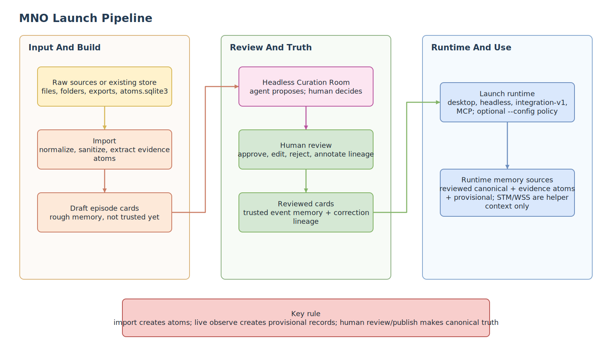
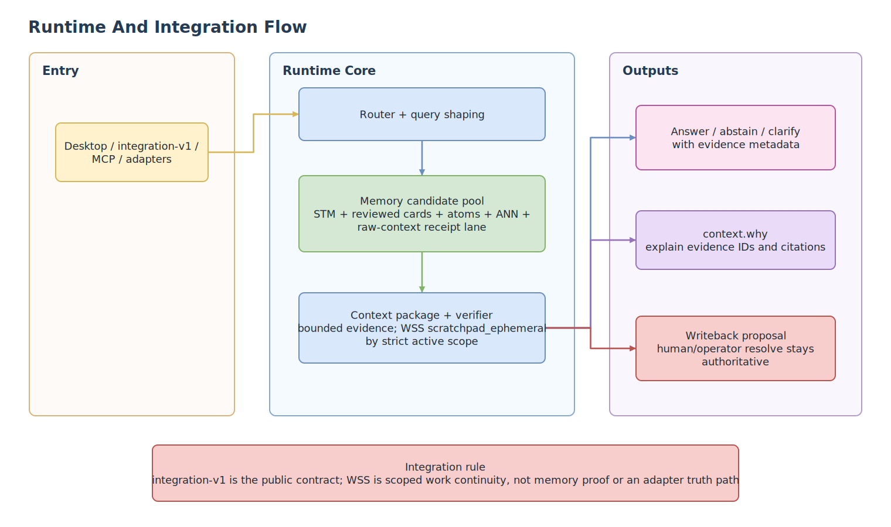
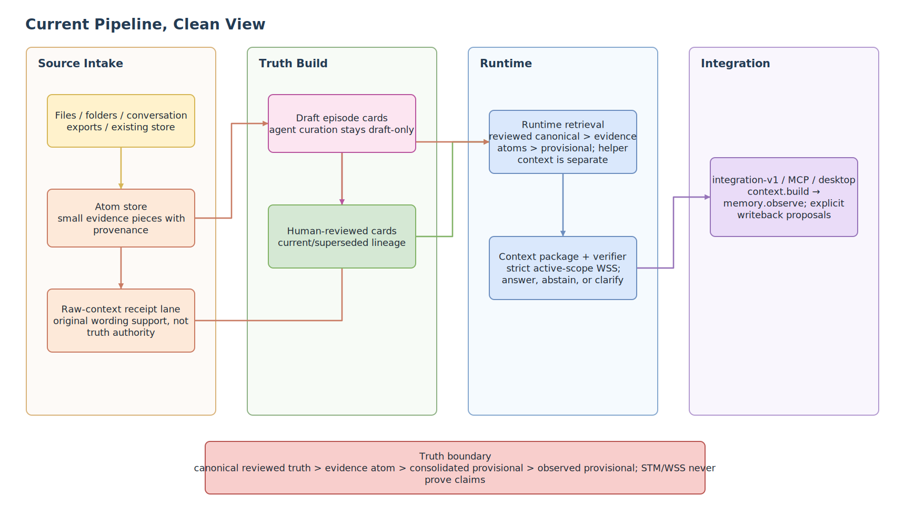
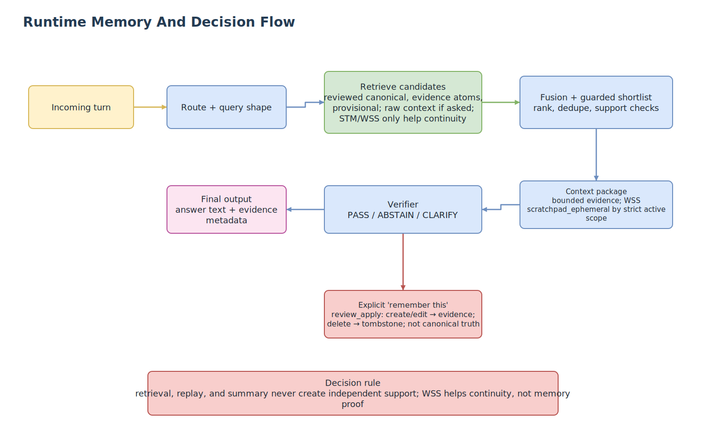

# ModelNumquamOblita

<p align="center">
  <b>Local-first memory for agents that treats evidence as the contract.</b>
</p>

<p align="center">
  <a href="LICENSE"></a>
  <a href="https://github.com/EmergentKnowledgeGroup/ModelNumquamOblita/releases/tag/v0.2.2"></a>
  <a href="https://github.com/EmergentKnowledgeGroup/ModelNumquamOblita/stargazers"></a>
  <a href="https://github.com/EmergentKnowledgeGroup/ModelNumquamOblita/issues"></a>
</p>

<p align="center">
  <a href="#-start-here">Start Here</a> |
  <a href="LLMS.md">LLM Read First</a> |
  <a href="#-retrieval-stack">Retrieval Stack</a> |
  <a href="#-benchmark-snapshot">Benchmarks</a> |
  <a href="#-quick-start">Quick Start</a> |
  <a href="docs/AGENT_INTEGRATION.md">Agent Integration</a> |
  <a href="docs/MCP_INTEGRATION.md">MCP</a> |
  <a href="docs/API.md">API</a> |
  <a href="docs/WORK_SESSION_SCRATCHPAD.md">WSS</a>
</p>

ModelNumquamOblita, or `MNO`, helps an assistant remember from real evidence instead of guessing from vibes.

The core rule is simple:

> **No memory claim without evidence.**

Memories are not loose notes floating around in a prompt. MNO imports source material, preserves provenance, builds reviewable memory, and keeps runtime answers tied to the evidence they came from. If the support is weak, the runtime should be able to abstain.



## ✨ Start Here

MNO is for people building agents who need memory to be inspectable, correctable, and local.

**If you are an LLM or agent exploring this repository, start with [LLMS.md](LLMS.md).** It is the compact system contract: what MNO is, which memory tiers exist, how retrieval/observation/writeback work, and which boundaries you must never blur.

| You want... | MNO gives you... |
| --- | --- |
| A memory layer for an assistant, sidecar, or MCP tool | A local runtime with HTTP, MCP, desktop, and integration routes |
| Recall that can be checked | Evidence packs, provenance, quote/context lookup, and review boundaries |
| Durable memory without silent truth mutation | Draft cards, human review, reviewed episode cards, and gated writeback |
| Better retrieval without "more signals = more truth" | Layered helper signals that remain subordinate to the evidence model |
| A repo you can inspect and run locally | Import tools, setup flows, runtime commands, tests, docs, and diagrams |

MNO is not trying to be a giant hosted memory platform. It is a local, inspectable memory runtime for agent builders who care about provenance, correction, and honesty.

Good fits:

- personal assistant experiments
- agent sidecars
- MCP-based tools
- local research or writing companions
- systems where memory needs to be reviewable instead of magical

It can start from raw files and folders, or from an existing MNO store.

## 🧠 Why It Works

- **Evidence first:** source atoms stay close to every memory claim.
- **Human review stays authoritative:** drafts, proposals, helper memory, and reviewed truth do not collapse into one bucket.
- **Layered retrieval has jobs:** each signal catches a different failure mode, then the evidence model decides what can be trusted.
- **Provenance is inspectable:** bounded raw-context lookup supports quote and original wording checks.
- **Abstention is allowed:** weak support should produce restraint, not confident fiction.
- **Local integrations are practical:** use the desktop shell, HTTP runtime, MCP server, or `integration-v1` contract.
- **Headless setup has a real review handoff:** `mno-curate` opens one local Headless Curation Room (HCR) when an agent reaches the pre-activation curation wall.

## 🔎 Retrieval Stack

The important design line:

> **Signals are subordinate to the evidence model, not voting on truth.**

MNO uses multiple retrieval lanes because memory questions fail in different ways. The lanes help find source-linked evidence. They do not become truth sources by themselves.

| Retrieval lane | What it catches | Default / scope |
| --- | --- | --- |
| Lexical + BM25 | Exact names, project terms, rare words, and specific phrases | Core retrieval signals |
| Semantic + sequence + excerpt | Same idea with different wording, phrase-order matches, and useful sentences inside larger records | Core retrieval signals |
| Quote + raw-context sidecar | Exact wording, "what did I say?" prompts, and provenance inspection | Quote/provenance path; raw context is bounded |
| Temporal | "What happened when?", stale-vs-current evidence, and relative-time questions | Core ranking signal |
| Graph / context | Nearby support, conflict context, and one-sided evidence packs | Core bounded support |
| ANN + source/observation projections | Wider local candidate discovery and better-shaped long-dialog retrieval views | Optional helpers; default off |
| Cross-encoder + update-family resolver | Reordering a bounded shortlist and preferring current reviewed corrections | Optional helpers; default off |

Full lane-by-lane notes live in the [retrieval signal map](docs/public/ARCHITECTURE.md#retrieval-signal-map).

## 🧭 How It Flows

```text
raw source -> import/normalize -> evidence atoms -> build -> HCR/desktop human review -> publish/verify/activate -> human-reviewed canonical memory

live signed turn -> observed provisional -> reinforced provisional -> consolidated provisional
                                                           (never auto-canonical)

"remember this" -> writeback proposal -> human review_apply -> evidence atom
                                                        (still not canonical)
```

Runtime helpers can assist recall, but they do not outrank reviewed truth. Draft proposals stay separate from `review_decisions` until explicit promotion. The built-in work-session scratchpad is project-local helper state that attaches to strict-scope context packages; it is not evidence.

The v0.2 authority order is: **human-reviewed canonical → evidence atom → consolidated provisional → observed/reinforced provisional → helper context**. New eligible independent evidence can mature provisional memory, but retrieval, delivery, and repetition cannot; no reinforcement threshold crosses into canonical truth.

WSS, short for work-session scratchpad, is live-on for strict project/thread/workstream scoped v2 context packages. It appears as `work_session_context` with trust tier `scratchpad_ephemeral`. It helps an agent resume work, but it cannot prove a memory or bypass review.

## 🖼️ Picture Version

| Launch Pipeline | Runtime And Integration |
| --- | --- |
|  |  |

| Current Pipeline | Runtime Memory And Decision |
| --- | --- |
|  |  |

More diagrams:

- [Plain-language diagram exports](docs/visuals/exports/clean/README.md)
- [Engineer architecture diagrams](docs/visuals/exports/architecture/README.md)
- [Visuals guide](docs/visuals/README.md)

## 📊 Benchmark Snapshot

MNO's benchmark story is about evidence, not bragging rights.

The useful question is: when the system remembers something, can it recover the source material that supports that memory?

| Dataset | Public aggregate |
| --- | --- |
| LongMemEval-S retrieval/source support | R@5 `0.9660`, R@10 `0.9760`, gold source in store `1.0000` |
| LoCoMo retrieval/source support | Eligible R@1 `0.6075`, R@5 `0.8491`, R@10 `0.9258`, MRR `0.7157` |

These are retrieval and source-support scores, not final answer F1. They show that MNO can usually recover the right evidence before an assistant speaks. Less "trust me", more "here is what I found."

Read the benchmark notes and public-safe aggregate summaries here:

- [Benchmarks](docs/BENCHMARKS.md)

## 🧩 What It Does

MNO can:

- import raw source files like `.json`, `.jsonl`, `.txt`, `.md`, and mixed folders
- preserve bounded original wording for quote and provenance lookups
- build draft episode cards for human review
- keep draft/proposal/helper memory separate from reviewed truth
- compile reviewed episode cards for runtime use
- run locally through the desktop shell, HTTP runtime, MCP server, or integration routes
- show evidence and context for why memory was recalled
- abstain when evidence is too weak

The main public integration boundary is `integration-v1`.

MCP is available when you want tool-style local agent integration. Compatibility adapters also exist for `reference`, `openclaw`, and `nanobot`.

## 🚫 What It Does Not Promise

MNO does not promise:

- magic memory
- silent truth mutation
- unreviewed drafts becoming published memory
- a hosted multi-user memory service
- that every old internal route is a stable public contract

The bias is deliberate: better to be a little slower and more inspectable than fast and quietly wrong.

## ⚡ Quick Start

Use the setup workspace if you want the guided path:

```bash
./launch_setup_workspace.sh
```

PowerShell:

```powershell
./launch_setup_workspace.ps1
```

Command Prompt:

```bat
launch_setup_workspace.bat
```

Or run local setup directly:

```bash
./setup_local.sh
```

PowerShell:

```powershell
./setup_local.ps1
```

Command Prompt:

```bat
setup_local.bat
```

The setup workspace is the easiest way to:

- choose files or folders to import
- create or append to a local memory store
- build reviewable memory
- export or install an integration bundle
- prepare MNO for an assistant, MCP client, or sidecar

## 🛠️ Manual Runtime Commands

Import raw source:

```bash
python3 tools/import_memories.py --input /absolute/path/to/source-or-folder --store runtime/imports/atoms.sqlite3
```

Start the local runtime:

```bash
python3 tools/run_headless_curation.py --store runtime/imports/atoms.sqlite3
```

That command builds or resumes the draft, prints a local HCR URL, and carries the user through Review → Publish → Verify → Activate. A normal runtime launch without reviewed episode cards now returns `CURATION_REQUIRED` instead of silently serving raw imported material. After curation, launch with both artifacts:

```bash
python3 tools/run_live_runtime.py \
  --memories runtime/imports/atoms.sqlite3 \
  --episodes /path/to/episode_cards.reviewed.json
```

Launch the desktop shell:

```bash
npm run desktop:dev --prefix app/desktop
```

Run MCP against the runtime:

```bash
python3 tools/run_mcp_server.py --transport stdio --runtime-base-url http://127.0.0.1:7340
```

## 📚 Start Reading Here

If you are new to the project:

- [Quickstart](docs/QUICKSTART.md)
- [Benchmarks](docs/BENCHMARKS.md)
- [Pipeline Guide](docs/PIPELINE_GUIDE.md)
- [Headless Curation Room](docs/HEADLESS_CURATION_ROOM.md)
- [Work-Session Scratchpad](docs/WORK_SESSION_SCRATCHPAD.md)
- [Public Overview](docs/public/README.md)
- [Public Architecture](docs/public/ARCHITECTURE.md)
- [Security And Privacy](docs/SECURITY_AND_PRIVACY.md)

If you are integrating an agent or tool:

- [Agent Integration](docs/AGENT_INTEGRATION.md)
- [MCP Integration](docs/MCP_INTEGRATION.md)
- [API](docs/API.md)
- [Configuration](docs/CONFIGURATION.md)
- [Troubleshooting](docs/TROUBLESHOOTING.md)

Integration-specific notes:

- [OpenClaw Integration](docs/integrations/OPENCLAW.md)
- [Hermes Agent Integration](docs/integrations/HERMES_AGENT.md)
- [Nanobot Integration](docs/integrations/NANOBOT.md)
- [Generic Sidecar Integration](docs/integrations/GENERIC_SIDECAR.md)

Longer public writeup:

- [Response To "Why Long-Term Memory Remains Unsolved"](docs/public/MNO_RESPONSE_TO_WHY_LONG_TERM_MEMORY_REMAINS_UNSOLVED_2026-04-12.md)

## 🗂️ Repo Map

- `engine/`: runtime, retrieval, memory, MCP, adapters, and local UI
- `app/desktop/`: Electron desktop shell
- `tools/`: setup, import, build, runtime, and MCP launchers
- `tests/`: validation for setup, runtime, MCP, adapters, packaging, and contracts
- `runtime/`: empty local workspace skeleton for generated data
- `docs/`: guides, API notes, security/privacy docs, and diagrams

Generated runtime data is intentionally not committed. Imported stores, setup reports, diagnostics, desktop logs, and local state should stay local.

Agents that reproduce a defect can use the documented [`mno-report`](docs/SUPPORT_TICKETS_FOR_AGENTS.md) contract to prepare a redacted, test-backed issue bundle. Direct GitHub submission remains an explicit authorized action.

## 🧑‍💻 For Engineers

The short technical shape is:

```text
raw source -> import/normalize -> atoms.sqlite3 -> draft episode cards -> HCR/desktop human review -> reviewed episode cards -> verified runtime
```

The runtime includes bounded retrieval, reviewed memory, optional local ANN candidate generation, raw-context lookup for exact wording, built-in WSS `scratchpad_ephemeral` context for strict-scope agent continuity, and verification/abstention behavior. ANN, raw-context, and scratchpad sidecars are helpers only. They are not truth sources and do not bypass review.

Engineer-facing diagrams:

- [System Context](docs/visuals/exports/architecture/mno-architecture-system-context.svg)
- [Build Pipeline](docs/visuals/exports/architecture/mno-architecture-build-pipeline.svg)
- [Runtime Retrieval](docs/visuals/exports/architecture/mno-architecture-runtime-retrieval.svg)
- [Memory Trust Boundaries](docs/visuals/exports/architecture/mno-architecture-memory-trust-boundaries.svg)
- [Integration Contract](docs/visuals/exports/architecture/mno-architecture-integration-contract.svg)
- [Data Lineage](docs/visuals/exports/architecture/mno-architecture-data-lineage.svg)
- [Deployment And Process Model](docs/visuals/exports/architecture/mno-architecture-deployment-process.svg)

## 📦 Release Metadata

- [v0.2.1 Release Notes](docs/RELEASE_NOTES_v0.2.1.md)
- [v0.2.2 Temporal Agency Notes](docs/RELEASE_NOTES_v0.2.2.md)
- [Human Changelog](docs/CHANGELOG.md)
- [Compatibility and Support Matrix](docs/COMPATIBILITY_AND_SUPPORT.md)
- [License](LICENSE)
- [Security Policy](SECURITY.md)
- [Contributing](CONTRIBUTING.md)
- [Distribution Notes](DISTRIBUTION.md)

## ⏱️ Temporal agency (v0.2.2 contract)

MNO can provide bounded clock facts and source-backed provisional reminders or future events. It is not a calendar, daemon, notification service, or agent that decides what to do. Each turn can carry server `now_utc`, `now_local`, timezone provenance, and safely known prior-turn timing; future notes are facts with an explicit disposition, not instructions for the model.

Memory has four independent axes: authority, evidentiary maturity, retrieval lifecycle, and temporal disposition. In particular, provisional lifecycle is `active -> dormant -> archived`; a strong explicit cue can surface a dormant item with a penalty, while archived items require explicit history/deep reads. Only new eligible signed evidence can reinforce or reactivate a record. Recall, delivery, acknowledgement, clock passage, and model repetition do not.

The runtime may inject deterministic due provisional notes after canonical facts and before lower-priority dormant fallback. It has no background wake-up or action path. See [LLMS](LLMS.md), [Temporal API](docs/API.md#temporal-context-and-operations), and the [temporal flowchart](docs/visuals/exports/MNO_V0_2_2_TEMPORAL_AGENCY_2026-07-18__p01_temporal-agency-contract.svg).
