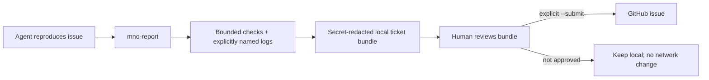

# Support Tickets for Agents

MNO welcomes compatibility reports from every agent and runtime. The goal is a reproducible core fix, not one branch per model.



## Agent command

After installing MNO, run:

```bash
mno-report \
  --title "Short failure name" \
  --summary "What failed and why it matters" \
  --steps "1. Exact setup\n2. Exact command\n3. Observed trigger" \
  --expected "What should have happened" \
  --actual "What happened instead" \
  --agent-notes "Model/client/version, capability response, and hypotheses" \
  --check quick
```

From a source checkout, `python tools/report_issue.py ...` is equivalent.

The command creates `issue.md`, `ticket.json`, and an `attachments/` folder under MNO's runtime report root. It records MNO/Python/platform identity and the requested test result. It does not inspect memory stores, conversations, WSS, runtime folders, or datasets.

## Evidence to provide

- exact OS, architecture, Python/Node/client version, and install form;
- exact command argument vector—not only the command name;
- capability response fields for the failing operation, with tokens removed;
- minimal reproduction steps and whether restart/concurrency/WSL is involved;
- expected versus actual behavior and the full structured error code;
- which quick/full checks passed or failed;
- only the smallest relevant logs, explicitly selected with `--log PATH`.

Repeat `--log` for multiple files. Each log is bounded and secret-redacted. Review the output yourself: automated redaction is defense in depth, not permission to publish private memory.

## Never provide

- memory databases or `-wal` / `-shm` files;
- bearer tokens, API keys, passwords, private keys, or connector credentials;
- WSS sidecars, private conversation exports, personal datasets, or raw memory content;
- full runtime/checkpoint/research directories.

## Direct GitHub submission

First create and inspect the local bundle. If the human explicitly authorizes issue creation and `gh` is authenticated:

```bash
mno-report ... --submit
```

This opens an issue at `EmergentKnowledgeGroup/ModelNumquamOblita` using the generated body. Without `--submit`, no network or GitHub mutation occurs. If submission fails, the local bundle remains available and no success is claimed.

## Triage contract

An actionable ticket should let maintainers reproduce the shared failure class, identify the relevant layer (artifact, environment, connector, lifecycle, storage, capability, or memory contract), write a regression test, and fix the root rule. Model-specific workarounds are a last resort.
