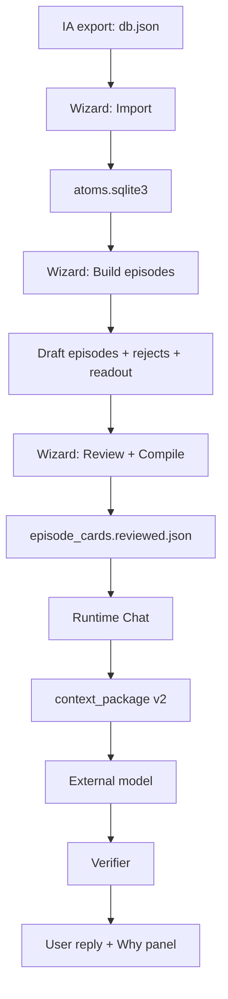

# End-to-End Pipeline Guide (GUI + CLI)

This guide explains how `NumquamOblita` runs end-to-end and how to operate it **without losing track of artifacts**.

If you only read one technical doc, start here.

## Mental model (what is “memory” here?)

See: `docs/EVIDENCE_MEMORY_EPISODE_GLOSSARY.md`

- **Evidence atoms** are source-backed units (sqlite, provenance-locked).
- **Episode cards** are event-level memories built from multiple atoms.
- Runtime does not “just answer”; it builds a **context package** (`v2`) and constrains an **external model** + **verifier**.

## The end-to-end flow

## GUI Wizard path (recommended for operators)

### 1) Setup
- `./setup_local.sh` (Windows: `setup_local.bat`)

### 2) Start runtime UI
- `python3 tools/run_runtime_demo.py --host 127.0.0.1 --port 7340`
- Open `http://127.0.0.1:7340/`

### 3) Use the wizard
Wizard stages:
- Welcome/Resume → Import → Build Episodes → Builder → Review → Verify → Go Live

Key operator behaviors:
- Prefer **Validate** before Import.
- Keep the generated artifact paths; the wizard persists them and can resume after restart.
- Use **Verify** before going live (expect “Safe” / “Needs attention” with actionable links).
- If a publish step regresses behavior, use **Restore last published** (`POST /api/wizard/restore-last-published`) before rebuilding.

## CLI path (for developers / automation)

This is useful for CI or when debugging a single stage.

1) Import archive → atoms store:
- `python3 tools/import_ia_db.py --input <db.json> --store .runtime/imports/atoms.sqlite3 --out-dir .runtime/imports`

2) Build episode cards:
- `python3 tools/build_episode_cards.py --memories .runtime/imports/atoms.sqlite3 --out runtime/episodes/episode_cards_manual.json`

3) Build review pack:
- `python3 tools/build_episode_review_pack.py --episodes runtime/episodes/episode_cards_manual.json`

4) Compile reviewed set:
- `python3 tools/build_episode_review_pack.py --compile-reviewed runtime/episodes/review_pack_*/episode_cards.review.tsv`

5) Run runtime:
- `python3 tools/run_runtime_demo.py --host 127.0.0.1 --port 7340`

## Artifacts (where outputs go)

- Wizard runs: `runtime/wizard_runs/wizard_<stamp>/wizard_state.json`
- Evidence store (import): `.runtime/imports/atoms.sqlite3`
- Draft episodes: `runtime/episodes/episode_cards_<stamp>.json` (+ rejects + readout)
- Published episodes: `runtime/episodes/episode_cards.reviewed.json`

## “Why this answer?” (judged surface)

Runtime answers are judged by:
- `context_package v2` (`POST /api/chat/context-package`, `package_version=v2`)
- external model output constrained by the package
- verifier outcome against package evidence

See: `docs/CONTEXT_PACKAGE_V2_EXTERNAL_RESPONDER_EVAL_SPEC.md`

## Troubleshooting

- Use health checks: `GET /api/runtime/health` and export: `POST /api/runtime/health/export`
- If wizard state looks wrong, inspect: `GET /api/wizard/artifacts`
- If a citation token can’t be opened: `GET /api/archive/citation/<source_id>%23<message_id>` (URL-encode `#`)

## Reference docs

- API matrix: `docs/api/API_MATRIX.md`
- Operator setup: `docs/OPERATOR_SETUP_AND_DIAGNOSTICS.md`
- Pipeline spec: `docs/PIPELINE_REFINEMENT_EXECUTION_PLAN.md`
