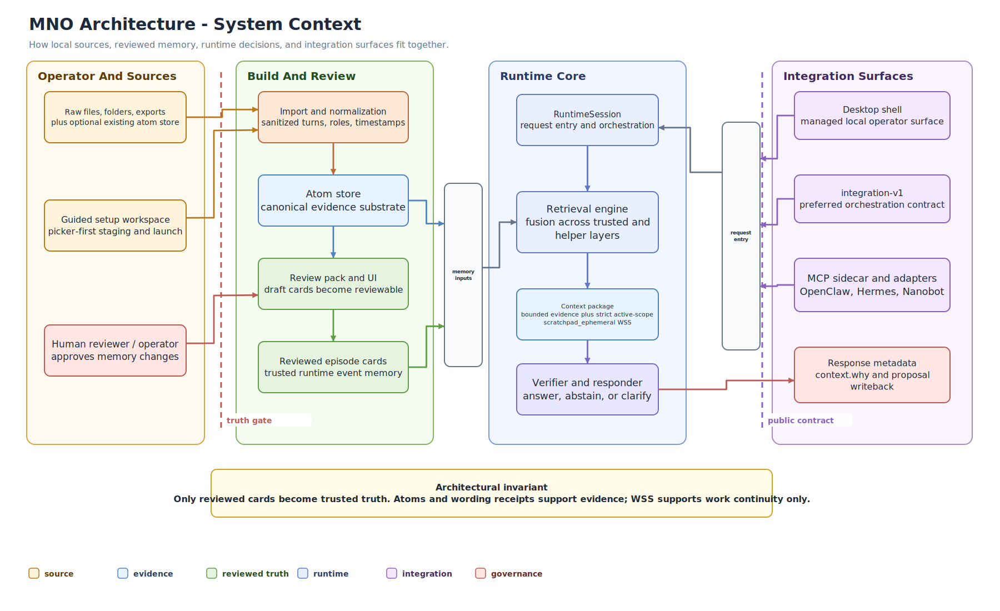
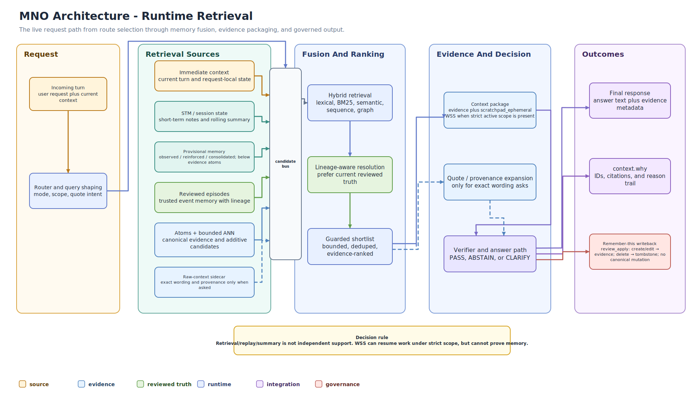
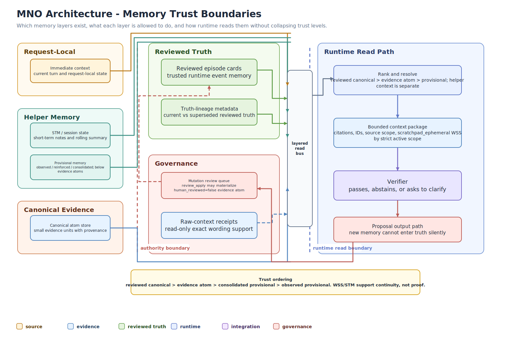

# Public Architecture

## High-level build flow

`raw source -> import/normalize -> atoms.sqlite3 -> draft episode cards -> optional draft curation -> human review -> reviewed episode cards -> runtime`

## High-level runtime flow

`incoming turn -> route -> shortlist evidence -> build context package -> answer or abstain -> optional proposal-only writeback`

## Import behavior

Raw-source import is normalized before extraction:
- supported files are converted into clean conversations and turns
- original normalized wording is preserved in a bounded raw-context sidecar for provenance and quote retrieval
- whitespace is cleaned
- roles and timestamps are normalized when possible
- junk folders are skipped during folder walks
- the desktop setup flow lets operators pick files and folders through the explorer UI, mix them in one source list, and either create a new store or append into an existing one

## Main memory layers

- atoms
  - the durable evidence substrate
- reviewed episode cards
  - the reviewed event-memory layer
  - can carry explicit truth-family lineage so corrected versions stay linked
- runtime helper layers
  - short-term memory
  - provisional memory
  - proposal-only writeback
  - continuity surfaces like pins, action log, wake-up pack, and resume pack

Important rule:

Runtime helper layers do not outrank reviewed truth.

Reviewed lineage metadata also does not silently rewrite history. It helps the runtime prefer the current reviewed version while still preserving older reviewed context.

## Retrieval shape

Current retrieval shape is:

`query -> lexical + bm25 + semantic + sequence + quote + excerpt + temporal + graph + bounded ANN -> fusion -> guarded shortlist -> evidence pack -> verifier`

`ANN` means `approximate nearest neighbor`.

In MNO it is:
- local
- bounded
- additive only
- kill-switchable

## Retrieval signal map

MNO uses multiple retrieval signals because memory questions fail in different ways.

The signals are subordinate to the evidence model. They do not vote on truth. They help locate source-linked evidence, then reviewed memory, provenance, and verifier/review gates decide whether a memory claim can be made.

| Lane | Why it exists | Failure it catches | Default / scope |
| --- | --- | --- | --- |
| Lexical | Direct token overlap for plain recall | Exact names, project terms, and inside-language that should not need fuzzy matching | Core retrieval signal |
| BM25 | Keyword ranking with common-term control | Rare words and specific phrases getting diluted by broad text overlap | Core retrieval signal |
| Semantic / near-match | Fuzzy overlap without making embeddings the authority | Same idea written with different wording | Core retrieval signal |
| Sequence | Phrase-order alignment | The right passage has the same ordered words even when exact quote marks are missing | Core retrieval signal |
| Quote | Exact quote and verbatim recall | "What exactly did I say?" or "quote that back" style prompts | Core quote signal |
| Excerpt | Local passage matching inside longer atoms | The answer is buried in one useful sentence inside a larger source | Core retrieval signal |
| Raw-context sidecar | Bounded original wording for provenance inspection | Compressed atoms/cards are too lossy for exact wording | Explicit quote/provenance requests only |
| Temporal | Time-aware ordering | "What happened when?", stale-vs-current evidence, and relative-time questions | Core ranking signal |
| Graph / context | Neighbor and conflict support | One-sided evidence packs or missing nearby context | Core bounded support |
| ANN sidecar | Wider local candidate discovery | A good source exists but the lexical/near-match shortlist misses it | Optional helper; default off |
| Source projection | Better-shaped source/session retrieval units | Long-dialog evidence is present but represented at an awkward atom shape | Optional helper; default off |
| Observation projection | Read-only assertion-style retrieval view | Persona or long-dialog facts are easier to find as source-linked observations | Optional helper; default off |
| Cross-encoder reranker | Reorder an already-bounded shortlist | The right evidence is present but ranked too low | Optional helper; default off |
| Update-family resolver | Prefer current reviewed evidence inside explicit correction families | Older corrected evidence competes with newer reviewed truth | Optional helper; default off |

The design goal is not to maximize the number of signals. The goal is to recover the strongest source-supported evidence while keeping every retrieval helper subordinate to MNO's truth contract.

## Integration surfaces

- desktop shell
- headless runtime over HTTP
- `integration-v1` public orchestration contract
- MCP sidecar
- compatibility adapters for `reference`, `openclaw`, and `nanobot`

## Truth boundaries

- import creates evidence atoms
- build creates draft cards
- optional draft curation stays draft-only
- human review remains authoritative
- writeback is propose/resolve gated
- verifier remains in the live answer path

## Visual reference

## Engineer architecture reference

- [Clean Public Diagram Exports](../visuals/exports/clean/README.md)
- [Architecture Diagram Exports](../visuals/exports/architecture/README.md)
- [Rendered SVG/PNG Export Index](../visuals/exports/README.md)
- [Launch Pipeline Visual Spec](../visuals/MNO_LAUNCH_PIPELINE_VISUAL_SPEC_2026-04-12.md)
- [Launch Pipeline Draw.io](../visuals/MNO_LAUNCH_PIPELINE_2026-04-12.drawio)
- [Launch Runtime And Integration Visual Spec](../visuals/MNO_LAUNCH_RUNTIME_AND_INTEGRATION_VISUAL_SPEC_2026-04-12.md)
- [Launch Runtime And Integration Draw.io](../visuals/MNO_LAUNCH_RUNTIME_AND_INTEGRATION_2026-04-12.drawio)
- [Current Pipeline Visual Spec](../visuals/MNO_CURRENT_PIPELINE_VISUAL_SPEC_2026-04-12.md)
- [Current Pipeline Draw.io](../visuals/MNO_CURRENT_PIPELINE_2026-04-12.drawio)
- [Current Runtime Memory And Decision Visual Spec](../visuals/MNO_CURRENT_RUNTIME_MEMORY_AND_DECISION_VISUAL_SPEC_2026-04-12.md)
- [Current Runtime Memory And Decision Draw.io](../visuals/MNO_CURRENT_RUNTIME_MEMORY_AND_DECISION_2026-04-12.drawio)
- [Response To "Why Long-Term Memory Remains Unsolved"](MNO_RESPONSE_TO_WHY_LONG_TERM_MEMORY_REMAINS_UNSOLVED_2026-04-12.md)
