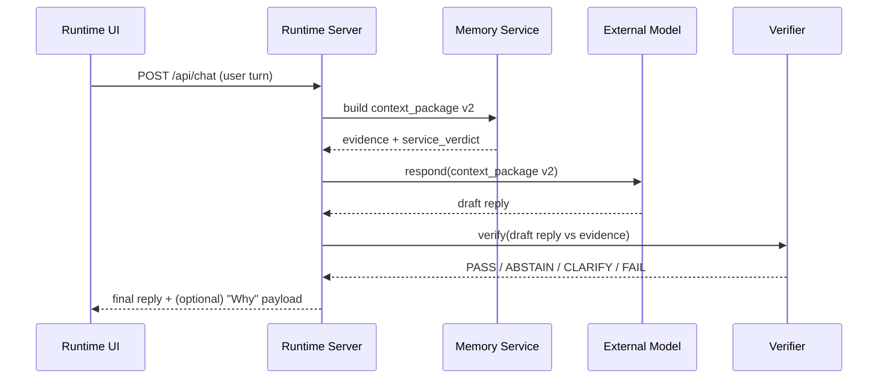
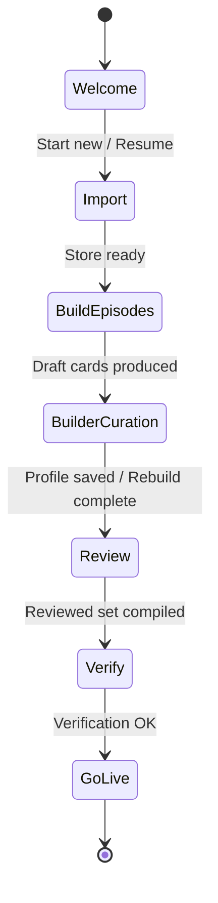

# NumquamOblita Architecture (Public)

This document explains the system at a “how it really works” level without requiring you to read the code.

Core promise: **no memory claim without evidence**.

## Components (what exists, in plain terms)

- **Archive export**: an input file (e.g., IA `db.json`) containing conversations.
- **Importer**: converts archive messages into an **evidence store** (atoms in SQLite) with provenance.
- **Episode builder**: groups multiple evidence atoms into **episode cards** (event-level memories).
- **Review + publish**: operators approve/edit/reject draft episode cards, producing a reviewed set used by runtime.
- **Runtime server**: builds a **context package v2** for each user turn, calls an external model, then verifies output.
- **Runtime UI**: a local web UI that exposes the wizard, chat, “Why this answer?”, memory browsing, and ops/health.

## High-level pipeline (import → episodes → runtime)

```mermaid
flowchart TD
  A[Archive export: IA db.json] --> B[Import]
  B --> C[atoms.sqlite3<br/>(evidence atoms + provenance)]
  C --> D[Episode build]
  D --> E[Draft episodes<br/>+ rejects + readout]
  E --> F[Review + Compile]
  F --> G[episode_cards.reviewed.json<br/>(published)]
  G --> H[Runtime chat]
  H --> I[context_package v2<br/>(bounded evidence + service verdict)]
  I --> J[External model (provider)]
  J --> K[Verifier]
  K --> L[User reply]
```

## Runtime request flow (what happens on a chat turn)

The external model is treated as **untrusted**: it receives a bounded context package and its output is verified.



## Data artifacts (what gets written where)

The system uses “draft vs published” artifacts so you can iterate without accidentally shipping unreviewed outputs.

- Evidence store (SQLite): `.runtime/imports/atoms.sqlite3`
- Draft episodes: `runtime/episodes/episode_cards_<stamp>.json` (+ rejects + readout)
- Reviewed/published episodes: `runtime/episodes/episode_cards.reviewed.json`
- Wizard state (resumable): `runtime/wizard_runs/wizard_<stamp>/wizard_state.json`
- Live run logs: `runtime/live_runs/live_<stamp>/`

## Citations (token format + URL encoding)

Citation tokens are strict and canonical:
- format: `source_id#message_id`

When a citation token is used in a URL path segment, the `#` must be URL-encoded:
- `conv_123#m000045` → `conv_123%23m000045`

Example route:
- `GET /api/archive/citation/<source_id>%23<message_id>`

## Wizard state machine (operator mental model)



## Where to read next

- End-to-end operator guide: `docs/guides/PIPELINE_END_TO_END.md`
- Runtime UI tour: `docs/guides/RUNTIME_UI_TOUR.md`
- API contract matrix: `docs/api/API_MATRIX.md`
- Execution spec / roadmap: `docs/PIPELINE_REFINEMENT_EXECUTION_PLAN.md`

